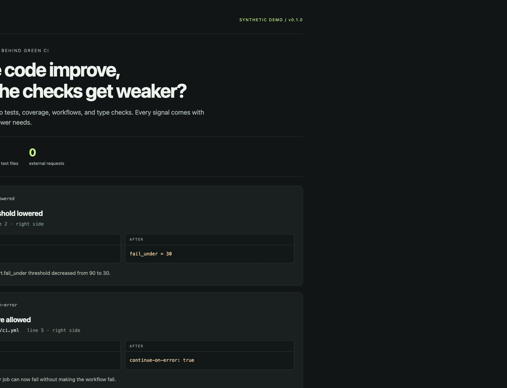

# Gate Drift

**Did the code improve, or did the checks get weaker?**

Gate Drift reviews Git changes for newly skipped tests, lower coverage requirements, swallowed CI failures, and disabled type or lint checks. Every finding points to a changed line and includes before/after evidence.

Python 3.10+ · Git 2.29+ · **zero runtime dependencies** · offline · MIT

[See real repository evidence](https://toufichajj.dev/gate-drift/validation.html) · [Try the synthetic demo](https://toufichajj.dev/gate-drift/) · [Download the latest release](https://github.com/thajj/gate-drift/releases/latest)

```diff
- test('rejects invalid credentials', () => {
+ test.skip('rejects invalid credentials', () => {
    expect(login('bad')).toBe(401);
  });
```

CI can go green while this check stops running. Gate Drift makes that change visible to the reviewer.

## Try it in 20 seconds

```sh
git clone https://github.com/thajj/gate-drift.git
cd gate-drift
python3 -m gate_drift --demo --html gate-drift-report.html --no-fail
```

Open `gate-drift-report.html` in a browser. The demo uses synthetic changes and inspects no real repository. No install, account, model, or API key is needed.

Prefer a ZIP? Download `gate-drift-0.1.1.zip` from [release v0.1.1](https://github.com/thajj/gate-drift/releases/tag/v0.1.1), extract it, and open a terminal in the extracted `gate-drift-0.1.1` folder. Run the same Python demo command above; cloning and installation are optional.



To review your own project, run this from the Gate Drift folder:

```sh
python3 -m gate_drift --repo /path/to/project --html review.html --no-fail
```

This compares tracked staged and unstaged changes with your project's `HEAD`. Open `review.html` to inspect the findings. [More comparison options](#review-your-own-changes) are below.

## Evidence from real repositories

The [published history report](https://toufichajj.dev/gate-drift/validation.html) checks 50 pinned comparisons from pytest, Vitest, Playwright, ESLint, EventRelay, and ebg-protrack. It records 11 source-addressed signals across four rule families, exact expected locations, and out-of-scope changes. Some findings are intentional maintenance decisions, such as Playwright skipping a test that starts its own tracing and ESLint allowing a failed step so a notification can run.

Forty comparisons are consecutive first-parent transitions from two frozen repository heads. Ten are selected historical examples; two inspect only configuration files. A separate AI review pass labeled source diffs without detector output. The initial detector missed three Vitest conditional skips; this sample helped improve the rules. These are project-authored regression cases, **not a held-out accuracy estimate** or validation by the upstream maintainers.

Reproduce the source checks without running upstream code:

```sh
# Explicit network step: fetch pinned public Git objects without checkout.
python3 scripts/fetch_validation_history.py

# Offline analysis: fail on missing signals, extra signals, or invalid addresses.
python3 scripts/validate_history.py --repos-root .validation-repos --output validation-local.json
```

The [dataset](validation/dataset.json), [recorded results](docs/validation.json), and [baseline misses](docs/baseline.json) are committed. The history sample exercises test skips, workflow failure handling, coverage thresholds, and explicit TypeScript strict settings; it does not establish coverage of every rule or syntax.

## Review your own changes

Run from the cloned Gate Drift folder:

```sh
# Compare all tracked working-tree changes (staged and unstaged) with HEAD.
python3 -m gate_drift --repo /path/to/project

# Compare only the staged index with HEAD.
python3 -m gate_drift --repo /path/to/project --staged

# Compare two exact commit snapshots. Fetch refs in your project first.
python3 -m gate_drift --repo /path/to/project --base origin/main --head HEAD

# Review the complete branch delta from its merge base.
python3 -m gate_drift --repo /path/to/project \
  --base "$(git -C /path/to/project merge-base origin/main HEAD)" --head HEAD

# Produce machine-readable output and an offline report together.
python3 -m gate_drift --repo /path/to/project --format json --html review.html
```

Exit codes: **0** no supported rule matched; **1** review signals found; **2** inspection failed. `--no-fail` keeps report mode at exit 0 when findings exist. Errors still exit 2. Untracked files are excluded; stage new files before reviewing them.

Optionally install into a virtual environment with `python3 -m pip install .` and use `gate-drift` as the command. This may download a build backend; running directly from the clone needs only the standard library.

## What it looks for

- Added skip/focus markers in JavaScript/TypeScript, Python, and Go tests.
- Deleted test files.
- Added `continue-on-error: true` in GitHub Actions workflows.
- Check commands that start swallowing failures with `|| true` or `; exit 0`.
- Lowered supported coverage thresholds.
- Disabled TypeScript strict checking, enabled `noCheck`, and added type/lint suppression directives.

Read the [rule reference](docs/rules.md) for exact supported patterns. Gate Drift checks changes; existing exceptions that simply remain in place are not new findings.

## Use in CI

Gate Drift is deliberately a small command you can audit. This example uses a separate tool checkout and exact pull-request SHAs:

```yaml
name: Gate Drift
on: [pull_request]
permissions:
  contents: read
jobs:
  review-gates:
    runs-on: ubuntu-latest
    steps:
      - uses: actions/checkout@v4
        with:
          fetch-depth: 0
          path: project
      - uses: actions/checkout@v4
        with:
          repository: thajj/gate-drift
          ref: v0.1.1 # Pin a reviewed commit SHA for stronger reproducibility.
          path: gate-drift
      - uses: actions/setup-python@v5
        with:
          python-version: '3.12'
      - name: Review changes to quality gates
        working-directory: gate-drift
        env:
          BASE_SHA: ${{ github.event.pull_request.base.sha }}
          HEAD_SHA: ${{ github.event.pull_request.head.sha }}
        run: |
          python3 -m gate_drift --repo ../project \
            --base "$BASE_SHA" --head "$HEAD_SHA" --format markdown \
            >> "$GITHUB_STEP_SUMMARY"
```

Make the check required in branch protection if you want findings to hold a merge for review. A contributor can intentionally weaken a check; reviewers still decide whether that change is justified.

## Exceptions and limits

`--ignore RULE_ID` suppresses a rule explicitly, records the ignored rule and omitted count in the report, and can be repeated. Use a reviewed CI configuration for exceptions. Gate Drift never rewrites tests or configuration.

This is a **heuristic review aid**, not a correctness, security, or intent verdict. A clean report is not proof that checks are intact. Conditional disabling, custom runners, imported configuration, multiline constructs, deleted assertions, and renamed test functions are not comprehensively modeled. Added suppressions and intentional threshold reductions can be legitimate findings. There is no invented safety score.

Only tracked text files are inspected. Binary files and working-tree symlinks are listed as excluded. Changed files over 2 MiB cause an inspection error. CRLF line endings are normalized for text comparison. Reports contain source snippets and paths; review them before sharing. The tool sends no network requests and never executes repository code.

## Development

```sh
python3 -m unittest discover -s tests -v
python3 -m unittest discover -s scripts -p 'test_*.py' -v
```

See [CONTRIBUTING.md](CONTRIBUTING.md). A useful contribution includes a small missed or misleading diff, expected behavior, and a regression test.

## Related work

[GreenLie](https://github.com/adindamochamad/GreenLie) focuses on assertion weakening. [VibeGuard](https://github.com/dgenio/vibeguard) includes test-integrity checks among a broader collection of review rules. Gate Drift is an independently implemented, narrow, dependency-free alternative centered on changed quality gates and portable evidence. These projects helped identify the problem; no accuracy comparison is claimed.

## License

[MIT](LICENSE).
